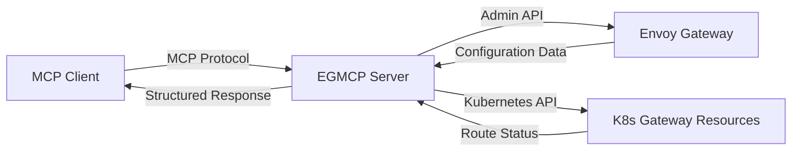
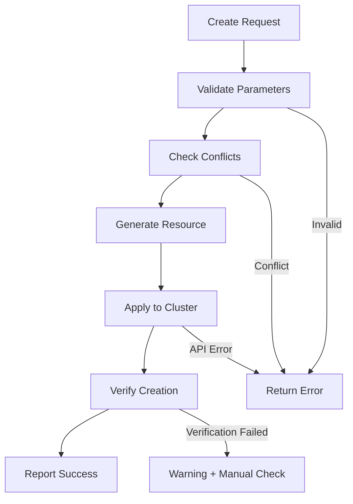

# EGMCP Server User Guide

Complete guide to using the EGMCP Server with MCP Client for comprehensive Envoy Gateway management including monitoring, route creation, and traffic configuration.

## Table of Contents

1. [Getting Started](#getting-started)
2. [Installation](#installation)
3. [Configuration](#configuration)
4. [Using with MCP Client](#using-with-claude-desktop)
5. [Available Tools](#available-tools)
6. [Route Management](#route-management)
7. [Gateway Configuration](#gateway-configuration)
8. [Common Use Cases](#common-use-cases)
9. [Safety Features](#safety-features)
10. [Troubleshooting](#troubleshooting)
11. [Advanced Configuration](#advanced-configuration)

## Getting Started

The EGMCP Server provides MCP Client with comprehensive access to your Envoy Gateway configuration, enabling both **read-only monitoring** and **write operations** for route management and traffic configuration using natural language.

### Prerequisites

- **MCP Client** (latest version with MCP support)
- **Envoy Gateway** deployed and accessible
- **Kubernetes cluster** with Gateway API resources
- **Network access** to Envoy Gateway admin API (typically port 19000)
- **kubectl access** for write operations
- **macOS, Linux, or Windows** for the server

### What's New

🎯 **Advanced Traffic Control**
- Traffic splitting for canary deployments and A/B testing
- Load balancing policy configuration (Round Robin, Least Request, Random, Ring Hash, Maglev)
- Backend service health check setup and monitoring
- Traffic policies (rate limiting, authentication, CORS, timeouts)

🧪 **Dry-Run Mode**
- Generate YAML manifests without applying to cluster
- Preview configuration changes before deployment
- GitOps workflow integration
- Safe validation and testing

🚀 **Route Creation and Management**
- Create HTTPRoute and GRPCRoute resources via natural language
- Delete and modify existing routes
- Full Gateway listener management

🛡️ **Production Safety Features**
- Read-only mode for safe monitoring
- Comprehensive input validation (RFC 1123 compliance)
- Enhanced error handling with detailed troubleshooting
- RBAC permission validation with clear guidance
- Resource conflict detection and prevention
- Real-time validation in both dry-run and live modes

⚡ **Enhanced Capabilities**
- 11 specialized tools for complete gateway management
- Generate-Apply-Verify pattern for reliable operations
- Real-time configuration feedback

### Quick Overview



## Installation

**For complete installation instructions, see the [main project README](../README.md#-quick-start).**

### Quick Setup Summary

1. **Install**: `curl -sSL https://raw.githubusercontent.com/saptak/egmcp-server/main/install.sh | bash`
2. **Setup Envoy**: `curl -sSL https://raw.githubusercontent.com/saptak/egmcp-server/main/setup-envoy.sh | bash`  
3. **Restart MCP Client**

### Alternative: NPX (No Installation)
```bash
npx @saptak/egmcp-server stdio-tools --envoy-url http://localhost:19001 --kubernetes.kubeconfig ~/.kube/config
```

## Configuration

**For detailed configuration options, see the [main README](../README.md#-configuration).**

### Key Configuration Options

- `--envoy-url`: Envoy Gateway admin API URL
- `--kubernetes.kubeconfig`: Path to kubeconfig file  
- `--kubernetes.read_only`: Enable read-only mode (safe for production)
- `--kubernetes.default_namespace`: Default namespace for operations
- `--log-level`: Logging verbosity (debug, info, warn, error)

## Using with MCP Client

### Basic Queries

Once connected, you can interact with your Envoy Gateway using natural language:

#### Status and Overview
- *"What's the current status of my Envoy Gateway?"*
- *"Give me a summary of the gateway configuration"*
- *"How many routes and services are configured?"*

#### Configuration Discovery
- *"Show me all the listeners in Envoy Gateway"*
- *"List the routes configured in my gateway"*
- *"What backend clusters are available?"*

#### Route Management
- *"Create a new route for api.example.com that sends traffic to my-service on port 8080"*
- *"Delete the route named test-route"*
- *"Add an HTTPS listener on port 443 to my gateway"*

#### Detailed Analysis
- *"Analyze my traffic routing configuration"*
- *"Show me the configuration for port 8080"*
- *"What routes point to the product-service cluster?"*

## Available Tools

The EGMCP Server provides 11 specialized tools for comprehensive Envoy Gateway management:

### Read-Only Monitoring Tools

#### 1. `list_envoy_listeners`

**Purpose**: Discover all listeners with their configurations

**Example Queries**:
- *"Use list_envoy_listeners to show me all ports"*
- *"What listeners are configured?"*

**Output**: JSON array of listener configurations including:
- Listener names and addresses
- Socket addresses and ports
- Protocol configurations

#### 2. `list_envoy_routes`

**Purpose**: Analyze traffic routing configuration

**Example Queries**:
- *"Run list_envoy_routes to see routing rules"*
- *"Show me the virtual hosts configuration"*

**Output**: Route configuration details including:
- Route names
- Virtual host mappings
- Path matching rules
- Cluster destinations

#### 3. `list_envoy_clusters`

**Purpose**: Discover backend services and clusters

**Example Queries**:
- *"Use list_envoy_clusters to find backends"*
- *"What services can receive traffic?"*

**Output**: Cluster information including:
- Cluster names and types
- Endpoint configurations
- Health check status

#### 4. `get_envoy_config_summary`

**Purpose**: Quick overview of entire configuration

**Example Queries**:
- *"Give me a config summary"*
- *"What's the overall gateway status?"*

**Output**: High-level summary with counts and status

### Write Operation Tools

#### 5. `create_http_route`

**Purpose**: Create new HTTPRoute resources for traffic routing

**Parameters**:
- `name`: HTTPRoute resource name
- `namespace`: Kubernetes namespace (optional, defaults to 'default')
- `gateway_name`: Target Gateway name
- `hostname`: Domain to match (e.g., 'api.example.com')
- `path`: URL path prefix (optional, defaults to '/')
- `service_name`: Backend Kubernetes service
- `service_port`: Backend service port

**Example Queries**:
- *"Create a route named api-route for api.example.com that sends traffic to api-service on port 8080"*
- *"Add a new route for orders.myapp.com pointing to orders-backend:3000 with path /api"*

**Safety Features**:
- Validates resource names and hostnames
- Checks for existing routes with same name
- Verifies Gateway exists before creation
- Applies Generate-Apply-Verify pattern

#### 6. `delete_http_route`

**Purpose**: Remove existing HTTPRoute resources

**Parameters**:
- `name`: HTTPRoute name to delete
- `namespace`: Kubernetes namespace (optional)

**Example Queries**:
- *"Delete the route named test-route"*
- *"Remove the api-route from the demo namespace"*

**Safety Features**:
- Verifies route exists before deletion
- Shows route details before removal
- Confirms successful deletion

#### 7. `modify_listener`

**Purpose**: Add or remove listeners (ports) on Gateway resources

**Parameters**:
- `gateway_name`: Gateway to modify
- `namespace`: Kubernetes namespace (optional)
- `port`: Port number for the listener
- `protocol`: Protocol (HTTP, HTTPS, TCP, etc.)
- `action`: 'add', 'create', 'remove', or 'delete'

**Example Queries**:
- *"Add an HTTPS listener on port 443 to demo-gateway"*
- *"Remove the listener on port 8080 from my gateway"*

**Safety Features**:
- Prevents duplicate port conflicts
- Validates protocol specifications
- Checks Gateway exists before modification

#### 8. `create_grpc_route`

**Purpose**: Create new GRPCRoute resources for traffic routing

**Parameters**:
- `name`: GRPCRoute resource name
- `namespace`: Kubernetes namespace (optional, defaults to 'default')
- `gateway_name`: Target Gateway name
- `hostname`: Domain to match (e.g., 'api.example.com')
- `service_name`: Backend Kubernetes service
- `service_port`: Backend service port

**Example Queries**:
- *"Create a gRPC route named api-route for api.example.com that sends traffic to api-service on port 8080"*

**Safety Features**:
- Validates resource names and hostnames
- Checks for existing routes with same name
- Verifies Gateway exists before creation
- Applies Generate-Apply-Verify pattern

#### 9. `delete_grpc_route`

**Purpose**: Remove existing GRPCRoute resources

**Parameters**:
- `name`: GRPCRoute name to delete
- `namespace`: Kubernetes namespace (optional)

**Example Queries**:
- *"Delete the gRPC route named test-route"*

**Safety Features**:
- Verifies route exists before deletion
- Shows route details before removal
- Confirms successful deletion

#### 10. `shift_traffic_percentage`

**Purpose**: Modify an existing HTTPRoute to split traffic between backend services for canary deployments

**Parameters**:
- `route_name`: Name of the HTTPRoute to modify
- `namespace`: Kubernetes namespace (optional, defaults to 'default')
- `primary_service`: Name of the primary backend service
- `canary_service`: Name of the canary backend service
- `primary_port`: Port number of the primary service
- `canary_port`: Port number of the canary service
- `canary_percentage`: Percentage of traffic to route to canary service (0-100)

**Example Queries**:
- *"Shift 50% of traffic to the canary service for the main-route"*

**Safety Features**:
- Validates inputs, prevents conflicts, Generate-Apply-Verify

#### 11. `configure_load_balancer`

**Purpose**: Configure load balancing policies for Gateway listeners

**Parameters**:
- `gateway_name`: Name of the Gateway to configure
- `namespace`: Kubernetes namespace (optional, defaults to 'default')
- `listener_name`: Name of the listener to configure
- `policy`: Load balancing policy to apply

**Example Queries**:
- *"Configure the load balancer for the main-gateway to use round_robin"*

**Safety Features**:
- Validates inputs, prevents conflicts, Generate-Apply-Verify

#### 12. `setup_health_check`

**Purpose**: Configure health checks for backend services via HTTPRoute annotations

**Parameters**:
- `route_name`: Name of the HTTPRoute to configure health checks for
- `namespace`: Kubernetes namespace (optional, defaults to 'default')
- `health_check_path`: Path for health check endpoint (optional, defaults to '/health')
- `interval_seconds`: Health check interval in seconds (optional, defaults to 30)
- `timeout_seconds`: Health check timeout in seconds (optional, defaults to 5)
- `healthy_threshold`: Number of successful checks to mark as healthy (optional, defaults to 2)
- `unhealthy_threshold`: Number of failed checks to mark as unhealthy (optional, defaults to 3)

**Example Queries**:
- *"Set up a health check for the main-route"*

**Safety Features**:
- Validates inputs, prevents conflicts, Generate-Apply-Verify

#### 13. `apply_traffic_policy`

**Purpose**: Apply advanced traffic policies like rate limiting, authentication, CORS, and timeouts to HTTPRoutes

**Parameters**:
- `route_name`: Name of the HTTPRoute to apply the policy to
- `namespace`: Kubernetes namespace (optional, defaults to 'default')
- `policy_type`: Type of traffic policy to apply
- `config`: Policy-specific configuration parameters

**Example Queries**:
- *"Apply a rate limit policy to the main-route"*

**Safety Features**:
- Validates inputs, prevents conflicts, Generate-Apply-Verify

## Dry-Run Mode & GitOps Integration

### Overview

The EGMCP Server includes a powerful dry-run mode that generates YAML manifests without applying them to your cluster. This is perfect for GitOps workflows, validation, and preview capabilities.

### Enabling Dry-Run Mode

Configure Claude Desktop with dry-run mode:

```json
{
  "mcpServers": {
    "egmcp-server": {
      "command": "npx",
      "args": [
        "@saptak/egmcp-server",
        "stdio-tools",
        "--envoy-url",
        "http://localhost:19001",
        "--kubernetes.dry_run"
      ],
      "env": {}
    }
  }
}
```

### Dry-Run Features

- **YAML Generation**: All write operations generate valid Kubernetes YAML
- **Validation**: Full input validation without cluster modification
- **Preview Mode**: See exactly what changes would be made
- **GitOps Ready**: Generated manifests ready for repository commit
- **Safety**: Zero risk of accidental cluster changes

### Example Dry-Run Queries

- *"Generate YAML manifest for a new route without applying it"*
- *"Show me what changes would be made for traffic splitting without applying them"*
- *"Preview the YAML for adding health checks to my route"*
- *"Run in dry-run mode to validate configurations before deployment"*

### GitOps Workflow Integration

1. **Generate**: Use EGMCP Server to create YAML manifests
2. **Review**: Inspect generated configurations
3. **Commit**: Add manifests to your GitOps repository
4. **Deploy**: Let your GitOps tool apply the changes

## Route Management

### Creating Routes

The EGMCP Server makes creating routes intuitive with natural language:

```text
"Create a route for my API service"
→ Prompts for required details: hostname, service name, port

"Add a route named user-api for users.example.com that sends traffic to user-service on port 3000"
→ Creates HTTPRoute with full configuration

"Create a route in the production namespace for payments.app.com pointing to payment-svc:8080 with path /api/v1"
→ Creates route with custom namespace and path
```

### Route Validation

All route creation includes comprehensive validation:

- **DNS Names**: Hostnames must be valid RFC 1123 subdomains
- **Resource Names**: Must follow Kubernetes naming conventions
- **Port Numbers**: Must be valid port ranges (1-65535)
- **Conflicts**: Prevents duplicate routes with same name
- **References**: Validates Gateway exists

### Route Lifecycle



## Advanced Traffic Control

### Traffic Splitting for Canary Deployments

Enable gradual traffic shifts between service versions:

```text
"Shift 20% of traffic from api-v1 to api-v2 for canary testing"
→ Modifies HTTPRoute to split traffic between services

"Gradually increase canary traffic to 50% for the user-api route"
→ Updates existing traffic split configuration
```

### Load Balancing Configuration

Configure load balancing policies for optimal traffic distribution:

**Available Policies:**
- **Round Robin**: Distribute requests evenly across backends
- **Least Request**: Route to backend with fewest active requests
- **Random**: Random distribution across healthy backends
- **Ring Hash**: Consistent hashing for session affinity
- **Maglev**: Google's Maglev consistent hashing algorithm

**Example Queries:**
```text
"Configure round robin load balancing for the main gateway listener"
→ Applies Round Robin policy to Gateway listener

"Set up least request load balancing for high-traffic services"
→ Configures Least Request policy for optimal performance
```

### Health Check Configuration

Set up comprehensive health monitoring for backend services:

**Health Check Parameters:**
- **Path**: Health check endpoint (default: `/health`)
- **Interval**: Check frequency (default: 30 seconds)
- **Timeout**: Request timeout (default: 5 seconds)
- **Healthy Threshold**: Successes to mark healthy (default: 2)
- **Unhealthy Threshold**: Failures to mark unhealthy (default: 3)

**Example Queries:**
```text
"Set up health checks for the user-api route with 30 second intervals"
→ Configures health monitoring with custom parameters

"Add health checks to payment-service with /status endpoint"
→ Sets up health monitoring with custom health path
```

### Traffic Policies

Apply advanced traffic management policies:

**Available Policy Types:**
- **Rate Limiting**: Control request rates per client
- **Authentication**: JWT, OAuth, API key validation
- **CORS**: Cross-origin resource sharing configuration
- **Timeouts**: Request and response timeout management

**Example Queries:**
```text
"Apply rate limiting of 100 requests per second to the api route"
→ Implements rate limiting policy

"Enable CORS for the frontend route allowing example.com origin"
→ Configures CORS policy with specified origins

"Add JWT authentication to the admin route"
→ Sets up JWT-based authentication
```

## Gateway Configuration

### Listener Management

Manage Gateway listeners (ports) easily:

```text
"Add HTTPS support to my gateway"
→ "Add an HTTPS listener on port 443 to [gateway-name]"

"Remove the test port from my gateway"
→ "Remove the listener on port 8080 from [gateway-name]"
```

### Protocol Support

- **HTTP**: Standard web traffic
- **HTTPS**: Secure web traffic (requires TLS configuration)
- **TCP**: Raw TCP traffic
- **UDP**: UDP traffic (where supported)

### Port Conflict Prevention

The server automatically prevents:
- Adding listeners on ports already in use
- Removing non-existent listeners
- Invalid port numbers (outside 1-65535 range)

## Common Use Cases

### 1. Service Discovery and Monitoring

**Scenario**: Understand current gateway configuration

**Queries**:
- *"What services are available behind my gateway?"*
- *"Give me a complete overview of my gateway setup"*
- *"Show me all the routes and their backends"*

### 2. New Service Deployment

**Scenario**: Add a new service to the gateway

**Workflow**:
1. *"Create a route for my new user service"*
2. *"Add HTTPS support if needed"*
3. *"Verify the route is working correctly"*

**Example**:
```text
User: "I need to expose my new user-management service on users.myapp.com"
Assistant: I'll create a route for your user-management service. Let me use the create_http_route tool.

[Creates route with proper configuration]

✅ Successfully created HTTPRoute 'user-management-route' in namespace 'default'!

📋 Configuration Details:
- Gateway: main-gateway
- Hostname: users.myapp.com
- Path: /
- Backend Service: user-management-service:8080
- Namespace: default

The route is now active and should be handling traffic.
```

### 3. Traffic Routing Changes

**Scenario**: Modify existing routing configuration

**Queries**:
- *"Change the backend for api.example.com to the new service"*
- *"Add a new path /v2 to route to the updated API"*
- *"Remove the old test routes"*

### 4. SSL/TLS Setup

**Scenario**: Add HTTPS support

**Queries**:
- *"Add HTTPS listener to my gateway"*
- *"Enable SSL for my services"*
- *"Configure port 443 for secure traffic"*

### 5. Environment Management

**Scenario**: Manage different environments

**Queries**:
- *"Create staging routes for testing"*
- *"Set up production traffic routing"*
- *"Isolate development services"*

### 6. Advanced Traffic Management

**Scenario**: Implement sophisticated traffic control

**Queries**:
- *"Set up canary deployment with 10% traffic to new version"*
- *"Configure health checks for critical services"*
- *"Apply rate limiting to prevent service overload"*
- *"Enable load balancing across multiple backend instances"*

### 7. GitOps and Validation

**Scenario**: Generate manifests for GitOps workflows

**Queries**:
- *"Generate YAML for new route configuration"*
- *"Preview traffic split changes without applying"*
- *"Validate configuration before deployment"*
- *"Create dry-run manifests for review process"*

### 8. Troubleshooting and Debugging

**Scenario**: Debug traffic issues

**Queries**:
- *"Why isn't traffic reaching my service?"*
- *"Show me the route configuration for failing requests"*
- *"Check if my service is properly configured in the gateway"*

## Safety Features

### Read-Only Mode

Enable read-only mode for safe production monitoring:

```bash
egmcp-server stdio-tools \
  --envoy-url http://localhost:19001 \
  --kubernetes.kubeconfig ~/.kube/config \
  --kubernetes.read_only
```

In read-only mode:
- ✅ All monitoring and inspection tools work
- ❌ No write operations are allowed
- 🛡️ Zero risk of accidental changes

### Dry-Run Mode

Enable dry-run mode for safe validation and GitOps workflows:

```bash
egmcp-server stdio-tools \
  --envoy-url http://localhost:19001 \
  --kubernetes.dry_run
```

In dry-run mode:
- ✅ All tools generate valid YAML manifests
- ✅ Full validation without cluster modification
- ✅ Perfect for GitOps and preview workflows
- ❌ No actual cluster changes are made
- 🛡️ Zero risk with full functionality

### Error Handling

Comprehensive error handling provides clear feedback:

- **Parameter Validation**: Clear messages for missing or invalid parameters
- **Resource Conflicts**: Prevents duplicate or conflicting resources
- **Permission Issues**: Detects and explains RBAC permission problems
- **Network Failures**: Graceful handling of connectivity issues
- **API Errors**: User-friendly translation of Kubernetes API errors

### Generate-Apply-Verify Pattern

All write operations follow a safe pattern:

1. **Generate**: Create resource configuration
2. **Apply**: Submit to Kubernetes API
3. **Verify**: Confirm successful creation
4. **Report**: Provide detailed feedback

### Resource Labeling

All created resources are labeled for tracking:
```yaml
metadata:
  labels:
    app.kubernetes.io/managed-by: egmcp-server
    app.kubernetes.io/created-by: egmcp-server
```

## Troubleshooting

### Common Issues and Solutions

#### "Server disconnected" in MCP Client

**Symptoms**: MCP Client shows "Server disconnected" for egmcp-server

**Solutions**:
1. **Check Envoy Gateway Access**: Run `curl http://localhost:19001/ready`
   - If fails, run: `curl -sSL https://raw.githubusercontent.com/saptak/egmcp-server/main/setup-envoy.sh | bash`
2. **Verify Kubernetes Access**: Run `kubectl get pods`
3. **Check Configuration**: Ensure kubeconfig path is correct and absolute
4. **Restart MCP Client** after any configuration changes

#### "Could not attach to MCP Server"

**Symptoms**: MCP Client shows attachment error

**Solutions**:
1. Verify binary path is absolute: `/usr/local/bin/egmcp-server`
2. Check binary is executable: `chmod +x /usr/local/bin/egmcp-server`
3. Ensure using `stdio-tools` in args
4. Check MCP Client configuration syntax is valid JSON
5. Verify kubeconfig path exists and is accessible

#### "Connection refused to Envoy Gateway"

**Symptoms**: Tools return connection errors

**Solutions**:
1. **Run automated setup**: `curl -sSL https://raw.githubusercontent.com/saptak/egmcp-server/main/setup-envoy.sh | bash`
2. **Manual port forward**: `kubectl port-forward -n envoy-gateway-system pod/YOUR_ENVOY_POD 19001:19000`
3. **Test connectivity**: `curl http://localhost:19001/ready`
4. **Check different URL**: Update `--envoy-url` parameter

#### "Kubernetes permission denied"

**Symptoms**: Write operations fail with forbidden errors

**Solutions**:
1. Verify kubectl access: `kubectl get httproutes`
2. Check RBAC permissions for Gateway API resources
3. Ensure service account has proper cluster role bindings
4. Use read-only mode for monitoring: `--kubernetes.read_only`

#### "Route creation fails with validation errors"

**Symptoms**: HTTPRoute creation rejected by API server

**Solutions**:
1. **Resource Names**: Use lowercase, hyphens only (no underscores or uppercase)
2. **Hostnames**: Ensure valid DNS format (no special characters)
3. **Ports**: Use valid port numbers (1-65535)
4. **Namespaces**: Ensure target namespace exists

### Debug Mode

Enable detailed logging in MCP Client config:

```json
{
  "mcpServers": {
    "egmcp-server": {
      "command": "/usr/local/bin/egmcp-server",
      "args": [
        "stdio-tools", 
        "--envoy-url", "http://localhost:19001",
        "--kubernetes.kubeconfig", "/Users/yourname/.kube/config",
        "--log-level", "debug"
      ],
      "env": {}
    }
  }
}
```

### Manual Testing

Test server functionality outside MCP Client:

```bash
# Test Envoy Gateway connectivity
curl http://localhost:19001/ready

# Test Kubernetes access
kubectl get gateways,httproutes -A

# Test MCP tools list
echo '{"jsonrpc": "2.0", "id": 1, "method": "tools/list", "params": {}}' | \
  egmcp-server stdio-tools --envoy-url http://localhost:19001 --kubernetes.kubeconfig ~/.kube/config

# Test route creation
echo '{"jsonrpc": "2.0", "id": 2, "method": "tools/call", "params": {"name": "create_http_route", "arguments": {"name": "test-route", "gateway_name": "demo-gateway", "hostname": "test.local", "service_name": "test-service", "service_port": 8080}}}' | \
  egmcp-server stdio-tools --envoy-url http://localhost:19001 --kubernetes.kubeconfig ~/.kube/config
```

### Health Check

Comprehensive health verification:

```bash
# Test all components
egmcp-server health --envoy-url http://localhost:19001 --kubernetes.kubeconfig ~/.kube/config
```

## Advanced Configuration

**For multi-environment setup, security considerations, and production deployment, see the [main README](../README.md#-configuration).**

### Key Security Points
- Use `--kubernetes.read_only` for production monitoring
- Restrict Envoy admin API access
- Configure proper RBAC permissions for Gateway API resources
- Protect kubeconfig files and use short-lived tokens

## Feedback and Support

### Reporting Issues
If you encounter bugs or have problems with installation or usage:
- **Report issues**: https://github.com/saptak/egmcp-server/issues

### Feature Requests
To request new features or enhancements:
- **Submit feature requests**: https://github.com/saptak/egmcp-server/issues

Please include:
- Your operating system and version
- MCP Client version
- Kubernetes cluster type and version
- Gateway API version
- Steps to reproduce (for bugs)
- Expected vs actual behavior
- Relevant error messages or logs
- Configuration files (sanitized)

### Contributing

Contributions are welcome! Please see:

### Release Notes

Stay updated with new features and improvements:
- **Releases**: https://github.com/saptak/egmcp-server/releases
