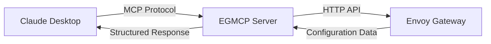

### **Alpha Software - Evaluation Only**

**Warning:** This MCP server is currently in an alpha stage and is **not ready for production use**. It is provided for evaluation purposes only. The authors and contributors bear no liability for any damages or issues that may arise from its use.

# EGMCP Server User Guide

Complete guide to using the EGMCP Server with Claude Desktop for Envoy Gateway management.

## Table of Contents

1. [Getting Started](#getting-started)
2. [Installation](#installation)
3. [Configuration](#configuration)
4. [Using with Claude Desktop](#using-with-claude-desktop)
5. [Available Tools](#available-tools)
6. [Common Use Cases](#common-use-cases)
7. [Troubleshooting](#troubleshooting)
8. [Advanced Configuration](#advanced-configuration)

## Getting Started

The EGMCP Server provides Claude Desktop with direct access to your Envoy Gateway configuration. This enables natural language queries and management of your service mesh infrastructure.

### Prerequisites

- **Claude Desktop** (latest version with MCP support)
- **Envoy Gateway** deployed and accessible
- **Network access** to Envoy Gateway admin API (typically port 9901/19000)
- **macOS, Linux, or Windows** for the server

### Quick Overview



## Installation

### NPX Installation (Recommended)

The simplest installation method uses NPX - no manual installation required:

```bash
# Test the server directly
npx @saptak/egmcp-server stdio-tools --envoy-url http://localhost:9901

# Use specific version
npx @saptak/egmcp-server@0.2.11 stdio-tools --envoy-url http://localhost:9901
```

For Claude Desktop, configure with:
```json
{
  "mcpServers": {
    "egmcp-server": {
      "command": "npx",
      "args": [
        "@saptak/egmcp-server",
        "stdio-tools",
        "--envoy-url",
        "http://localhost:9901"
      ],
      "env": {}
    }
  }
}
```

### Automatic Binary Installation

```bash
curl -sSL https://raw.githubusercontent.com/saptak/eg-mcp-server/main/install.sh | bash
```

The installer will:
1. Download the appropriate binary for your system
2. Install to `/usr/local/bin/egmcp-server`
3. Configure Claude Desktop automatically (preserving existing MCP servers)
4. Provide fallback instructions if automation is unavailable

### Envoy Gateway Setup

After installation, set up Envoy Gateway port forwarding:

```bash
curl -sSL https://raw.githubusercontent.com/saptak/eg-mcp-server/main/setup-envoy.sh | bash
```

This automatically detects and forwards the Envoy Gateway admin API to localhost:9901.

### Manual Installation

1. **Download Binary**
   ```bash
   # Download for your platform from GitHub releases
   wget https://github.com/saptak/eg-mcp-server/releases/latest/download/egmcp-server-linux-amd64
   chmod +x egmcp-server-linux-amd64
   sudo mv egmcp-server-linux-amd64 /usr/local/bin/egmcp-server
   ```

2. **Configure Claude Desktop**
   
   Edit `~/Library/Application Support/Claude/claude_desktop_config.json`:
   ```json
   {
     "mcpServers": {
       "egmcp-server": {
         "command": "/usr/local/bin/egmcp-server",
         "args": ["stdio-tools", "--envoy-url", "http://localhost:9901"],
         "env": {}
       }
     }
   }
   ```

3. **Set up Envoy Gateway Access**
   ```bash
   # Find Envoy Gateway pod
   kubectl get pods -n envoy-gateway-system
   
   # Forward admin API port
   kubectl port-forward -n envoy-gateway-system pod/YOUR_ENVOY_POD 9901:19000
   ```

## Configuration

### Claude Desktop Configuration

The Claude Desktop configuration specifies how to run the server:

```json
{
  "mcpServers": {
    "egmcp-server": {
      "command": "/usr/local/bin/egmcp-server",
      "args": ["stdio-tools", "--envoy-url", "http://localhost:9901"],
      "env": {}
    }
  }
}
```

The installation script automatically handles this configuration, preserving any existing MCP servers.

### Command Line Options

You can customize the Envoy Gateway connection:

```bash
# Different Envoy URL
egmcp-server stdio-tools --envoy-url http://different-host:9901

# Enable debug logging
egmcp-server stdio-tools --envoy-url http://localhost:9901 --log-level debug
```

## Using with Claude Desktop

### Starting Up

1. **Install and Configure** (one-time setup)
   ```bash
   curl -sSL https://raw.githubusercontent.com/saptak/eg-mcp-server/main/install.sh | bash
   ```

2. **Set up Envoy Gateway Access** (run when needed)
   ```bash
   curl -sSL https://raw.githubusercontent.com/saptak/eg-mcp-server/main/setup-envoy.sh | bash
   ```

3. **Restart Claude Desktop** to load the MCP server

4. **Verify Connection** - Claude Desktop should show "egmcp-server" as connected

### Basic Queries

Once connected, you can interact with your Envoy Gateway using natural language:

#### Status and Overview
- *"What's the current status of my Envoy Gateway?"*
- *"Give me a summary of the gateway configuration"*
- *"How many services are configured?"*

#### Configuration Discovery
- *"Show me all the listeners in Envoy Gateway"*
- *"List the routes configured in my gateway"*
- *"What backend clusters are available?"*

#### Detailed Analysis
- *"Analyze my traffic routing configuration"*
- *"Show me the configuration for port 8080"*
- *"What routes point to the product-service cluster?"*

## Available Tools

The EGMCP Server provides 4 specialized tools for Envoy Gateway management:

### 1. `list_envoy_listeners`

**Purpose**: Discover all listeners with their configurations

**Example Queries**:
- *"Use list_envoy_listeners to show me all ports"*
- *"What listeners are configured?"*

**Output**: JSON array of listener configurations including:
- Listener names
- Socket addresses and ports
- Filter chain configurations

### 2. `list_envoy_routes`

**Purpose**: Analyze traffic routing configuration

**Example Queries**:
- *"Run list_envoy_routes to see routing rules"*
- *"Show me the virtual hosts configuration"*

**Output**: Route configuration details including:
- Route names
- Virtual host mappings
- Path matching rules
- Cluster destinations

### 3. `list_envoy_clusters`

**Purpose**: Discover backend services and clusters

**Example Queries**:
- *"Use list_envoy_clusters to find backends"*
- *"What services can receive traffic?"*

**Output**: Cluster information including:
- Cluster names
- Cluster types (EDS, STATIC, etc.)
- Endpoint configurations

### 4. `get_envoy_config_summary`

**Purpose**: Quick overview of entire configuration

**Example Queries**:
- *"Give me a config summary"*
- *"What's the overall gateway status?"*

**Output**: High-level summary with counts and status

## Common Use Cases

### 1. Service Discovery

**Scenario**: Find what services are available

**Queries**:
- *"What services are available behind my gateway?"*
- *"List all backend clusters"*
- *"Show me the service endpoints"*

### 2. Traffic Routing Analysis

**Scenario**: Understand how traffic flows

**Queries**:
- *"How is traffic routed to my services?"*
- *"Show me the routing rules for domain example.com"*
- *"What happens to requests to /api/v1?"*

### 3. Port and Endpoint Discovery

**Scenario**: Find exposed ports and endpoints

**Queries**:
- *"What ports is my gateway listening on?"*
- *"Show me all the exposed endpoints"*
- *"Is there a listener for HTTPS traffic?"*

### 4. Configuration Validation

**Scenario**: Verify configuration is correct

**Queries**:
- *"Is my gateway configuration healthy?"*
- *"Are there any missing route configurations?"*
- *"Validate the current setup"*

### 5. Troubleshooting

**Scenario**: Debug connectivity issues

**Queries**:
- *"Why isn't traffic reaching my service?"*
- *"Show me the route for failing requests"*
- *"Check if the cluster is properly configured"*

## Troubleshooting

### Common Issues and Solutions

#### "Server disconnected" in Claude Desktop

**Symptoms**: Claude Desktop shows "Server disconnected" for egmcp-server

**Solutions**:
1. **Check Envoy Gateway Access**: Run `curl http://localhost:9901/ready`
   - If fails, run: `curl -sSL https://raw.githubusercontent.com/saptak/eg-mcp-server/main/setup-envoy.sh | bash`
2. **Verify Installation**: Check binary exists at `/usr/local/bin/egmcp-server`
3. **Restart Claude Desktop** after any configuration changes

#### "Could not attach to MCP Server"

**Symptoms**: Claude Desktop shows attachment error

**Solutions**:
1. Verify binary path is absolute: `/usr/local/bin/egmcp-server`
2. Check binary is executable: `chmod +x /usr/local/bin/egmcp-server`
3. Ensure using `stdio-tools` in args, not `stdio-minimal`
4. Check Claude Desktop configuration syntax is valid JSON

#### "Connection refused to Envoy Gateway"

**Symptoms**: Tools return connection errors

**Solutions**:
1. **Run automated setup**: `curl -sSL https://raw.githubusercontent.com/saptak/eg-mcp-server/main/setup-envoy.sh | bash`
2. **Manual port forward**: `kubectl port-forward -n envoy-gateway-system pod/YOUR_ENVOY_POD 9901:19000`
3. **Test connectivity**: `curl http://localhost:9901/ready`
4. **Check different URL**: Update `--envoy-url` parameter if using different endpoint

#### "Tools return empty results"

**Symptoms**: Successful connection but no configuration data

**Solutions**:
1. Verify Envoy Gateway has active configuration and routes
2. Ensure using correct admin API port (19000 for Gateway)
3. Check that Envoy Gateway is properly deployed and running

### Debug Mode

Enable detailed logging in Claude Desktop config:

```json
{
  "mcpServers": {
    "egmcp-server": {
      "command": "/usr/local/bin/egmcp-server",
      "args": ["stdio-tools", "--envoy-url", "http://localhost:9901", "--log-level", "debug"],
      "env": {}
    }
  }
}
```

### Manual Testing

Test server functionality outside Claude Desktop:

```bash
# Test Envoy Gateway connectivity
curl http://localhost:9901/ready

# Test MCP communication
echo '{"jsonrpc": "2.0", "id": 1, "method": "tools/list", "params": {}}' | egmcp-server stdio-tools --envoy-url http://localhost:9901

# Test tool execution
echo '{"jsonrpc": "2.0", "id": 2, "method": "tools/call", "params": {"name": "get_envoy_config_summary"}}' | egmcp-server stdio-tools --envoy-url http://localhost:9901
```

### Comprehensive Testing

Run the complete test suite:

```bash
# Download and run test suite
curl -sSL https://raw.githubusercontent.com/saptak/eg-mcp-server/main/test-suite.sh | bash
```

## Advanced Configuration

### Multiple Envoy Gateways

Configure for different environments:

```json
{
  "mcpServers": {
    "egmcp-production": {
      "command": "/usr/local/bin/egmcp-server",
      "args": ["stdio-tools", "--envoy-url", "http://prod-envoy:9901"],
      "env": {}
    },
    "egmcp-staging": {
      "command": "/usr/local/bin/egmcp-server", 
      "args": ["stdio-tools", "--envoy-url", "http://staging-envoy:9901"],
      "env": {}
    }
  }
}
```

### Remote Envoy Gateways

For remote or differently configured Envoy Gateways:

```json
{
  "mcpServers": {
    "egmcp-remote": {
      "command": "/usr/local/bin/egmcp-server",
      "args": ["stdio-tools", "--envoy-url", "http://remote-envoy.example.com:9901"],
      "env": {}
    }
  }
}
```

### Security Considerations

1. **Network Security**: Restrict access to Envoy admin API
2. **Authentication**: Use network-level authentication for admin API
3. **Logging**: Avoid logging sensitive configuration data
4. **Access Control**: Limit who can access Claude Desktop with EGMCP

## Feedback and Support

### Reporting Issues
If you encounter bugs or have problems with installation or usage:
- **Report issues**: https://github.com/saptak/eg-mcp-server/issues

### Feature Requests
To request new features or enhancements:
- **Submit feature requests**: https://github.com/saptak/eg-mcp-server/issues

Please include:
- Your operating system and version
- Claude Desktop version
- Steps to reproduce (for bugs)
- Expected vs actual behavior
- Relevant error messages or logs
